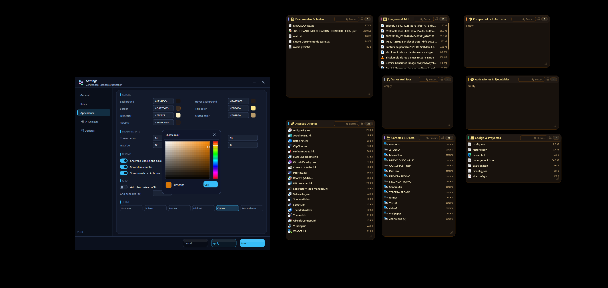
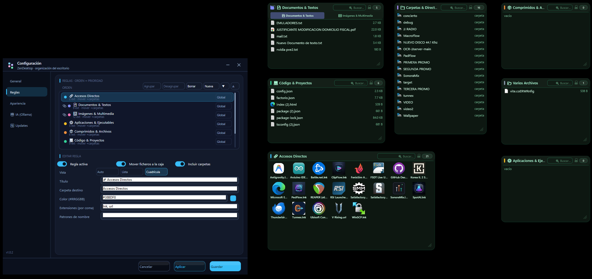

# 🧘 ZenDesktop

> Dynamic desktop organizer for Windows. Ultralight, native, and free.
> A modern open-source alternative to Stardock Fences.

<p align="center">
  
  
</p>

[](https://www.rust-lang.org)
[]()
[](LICENSE)
[](https://github.com/jaimitus/ZenDesktop/releases)

## ✨ Features

- **🪟 Floating translucent fences** — Group desktop files into elegant boxes with real alpha transparency
- **📑 Tabbed fences** — Group multiple fences under tabs within a single window to save desktop space
- **🔼 Roll-up fences** — Double click a fence's title bar to instantly roll it up, leaving only the title visible
- **📌 Pin to Top** — A pin button in the header makes any fence float above all apps (always-on-top), ideal for an Inbox or a notes box
- **💡 Header tooltips** — Hover the lock or pin icon to see what each toggle does, translated in your language
- **🎯 Smart Drag & Drop** — Drag files between fences, to subfolders, or to the desktop with visual feedback
- **📝 F2 Rename** — Press F2 on any item to directly rename it in place
- **⌨️ Keyboard navigation** — Arrow keys move the selection (Home/End to jump, Shift to extend); Enter opens, Delete trashes
- **📌 File favorites** — Pin important files to the top of any fence (Ctrl+P or the hover pin button)
- **🤖 Auto-organization** — Rules by extension, name, pattern, or local AI (Ollama) for automatic file classification
- **🔍 Advanced rules** — Filter rules by file size, age, or regex in addition to extension and name patterns
- **📦 Explorer drop** — Drop files from any folder directly into fences (native OLE drag & drop)
- **🔍 Integrated search** — Filter files within each fence in real time
- **📐 Grid + List view** — Grid or list mode, sortable by name, size, type, or date (with smooth scrolling)
- **🖼️ Per-fence icon size** — Each fence can override the global grid icon size (16–96 px) from Settings → Rules
- **🎨 Full customization** — Colors, borders, corner radius, font, icons, item counter
- **📂 Multi-desktop support** — Public desktop, OneDrive, and any additional folders
- **⏱️ Auto-archiving** — Move old files to an archive folder with configurable age
- **🌙 Zen Mode** — Hide/show all fences with double-click on desktop or `Ctrl+Alt+Z`
- **🧲 Magnetic snap** — Blue alignment guides while dragging fences (edges, centers, same-size)
- **📋 Layout templates** — Save named layout snapshots and reapply them with one click
- **🖥️ Multi-monitor aware** — Templates remember each fence's monitor and reposition correctly on any display setup
- **⚡ Auto-restore** — Mark a template as default and it applies itself when a known monitor connects (e.g. docking)
- **⏱️ Startup delay** — Optional delay so fences appear after Windows finishes loading
- **⚡ Live settings preview** — Every option applies instantly as you change it (no Apply button); Cancel reverts
- **🌍 Multi-language** — English, Spanish, German, French, Portuguese, Italian (dedicated Language tab)
- **🪶 Ultralight** — ~3 MB binary, ~4 MB RAM idle, 0% CPU (fully event-driven, no polling)
- **🔔 Toast notifications** — Visual feedback with a queue (🟢 drops, 🔵 organization) so they never overwrite each other
- **🤖 Local AI (Ollama)** — Semantic classification, automatic fence creation, and rule generation from a text description via local LLM
- **🧩 Lua widgets** — Programmable boxes that run user scripts (clocks, weather, launchers…) with a sandboxed API: drawing primitives, images, HTTP, interactivity and persistent state
- **🎧 Spotify widget** — first-class now-playing box (cover art, progress + times, volume slider, playback controls, device name, queue) managed from its own Settings tab: enable/disable, Client ID/Secret, connect & disconnect
- **📁 Dropbox widget** — browse, open and sync your Dropbox from a desktop box: folder navigation, download & open, local ↔ remote sync, and bidirectional drag & drop (drag files out, drop files in to upload) — managed from its own Settings tab
- **↩️ Undo moves** — Moving files into fences is undoable (Ctrl+Z or the toast action)
- **📐 Per-fence list/grid view** — Each rule picks its own view mode (auto/list/grid) from Settings → Rules

## 📥 Download

| Format | File | Best for |
|---|---|---|
| 🖥️ **Installer (EXE)** | `ZenDesktop-1.0.17-setup.exe` | Most users — wizard installer with Start Menu shortcut |
| 📦 **Installer (MSI)** | `ZenDesktop-v1.0.17-x64.msi` | Enterprises / system-wide installs with clean uninstall |
| 💾 **Portable** | `ZenDesktop-v1.0.17-portable.zip` | USB drives, custom paths, no installation |

All downloads are available at **[Releases](https://github.com/jaimitus/ZenDesktop/releases)**.

### 🖥️ EXE Installer (recommended)

1. Download `ZenDesktop-1.0.17-setup.exe` from [Releases](https://github.com/jaimitus/ZenDesktop/releases)
2. Run the installer — accepts the license, installs to `Program Files\ZenDesktop`
3. Start Menu shortcut is created automatically
4. Uninstall via Windows Settings → Apps, or re-run the installer

### 📦 MSI Installer

1. Download `ZenDesktop-v1.0.17-x64.msi` from [Releases](https://github.com/jaimitus/ZenDesktop/releases)
2. Run the installer — it installs to `Program Files\ZenDesktop` for all users
3. Start Menu shortcut is created automatically
4. Uninstall via Windows Settings → Apps, or re-run the MSI

### 💾 Portable (for USB drives / custom paths)

1. Download `ZenDesktop-v1.0.17-portable.zip` from [Releases](https://github.com/jaimitus/ZenDesktop/releases)
2. Extract to any folder (e.g. `%APPDATA%\ZenDesktop\`)
3. Run `ZenDesktop.exe` — it minimizes to the system tray
4. **Optional**: Add a shortcut to `shell:startup` for auto-start with Windows

> 💡 **Auto-update** works with the portable version too. When you click "Download & Install" in Settings → Updates, the new version replaces the current .exe and restarts automatically.

> 🔐 **Security**: Every update is cryptographically verified with an **Ed25519 signature** before it is installed. If the signature check fails, the download is discarded and the current version is left untouched. Released binaries also ship with a `SHA256SUMS.txt` so you can verify downloads manually.

> ⚠️ **Installed users (EXE/MSI)**: The app installs to `Program Files`, where standard users can't write. The in-app updater detects this and asks for administrator permission (UAC) automatically; you can also download the new installer from the release page instead.

### From source

```bash
git clone https://github.com/jaimitus/ZenDesktop.git
cd ZenDesktop
cargo build --release
# Binary at target/release/zendesktop.exe
```

## 🚀 Quick Start

| Action | Shortcut / Gesture |
|---|---|
| Open settings | Right-click tray icon → Settings |
| Zen Mode (toggle) | Double-click empty desktop or `Ctrl+Alt+Z` |
| Move files between fences | Select → Drag to another fence |
| Drop into subfolder | Drag over a folder inside a fence |
| Return to desktop | Drag outside all fences |
| Search in a fence | Click the search bar 🔍 |
| Change sort order | Right-click → Sort by |
| Lock fence position | Click the lock icon 🔒 |
| Pin fence always on top | Click the pin icon 📌 |
| Change icon size per fence | Settings → Rules → icon size chip |
| Move selection with keyboard | Arrow keys (Shift extends, Home/End jump) |
| Rename selected item | F2 → type → Enter |
| Pin a file to the top | Select → `Ctrl+P` (or click the 📌 on hover) |
| Delete selected item | Delete |
| Save layout template | Settings → General → Layout templates → Save layout |
| Auto-restore layout | Mark a template as default (★) in Settings → General |

## ⚙️ Configuration

Edit via the Settings window (tray icon) or directly in `config.toml`:

```toml
[general]
language = "en"
sweep_interval_minutes = 15

[appearance]
background = "#1A1B2E"
corner_radius = 12.0
font_family = "Segoe UI"

[[rules]]
id = "documents"
folder = "Documents"
extensions = ["pdf", "docx", "txt", "md"]
color = "#4CCD3C"
enabled = true
```

## 🧩 Widgets (Lua)

Widgets are **programmable boxes**: each one runs a Lua script that draws its
own content on the desktop — a clock, the weather, a notes panel, a launcher,
or anything else you can draw.

### Quick start

1. Open **Settings → 🧩 Widgets**. The bundled examples (`Reloj`, `Notas`,
   `Clima`, `Contador`) are installed automatically on first run.
2. Select one and press **"Añadir como caja"** — the box appears on the
   desktop instantly. Drag it by its header, resize from the corner.
3. **Edit the code** inline in the same tab (press *Guardar* to reload) or
   edit the `.lua` files directly in the widgets folder:
   - portable mode: `widgets/` next to `zendesktop.exe`;
   - installed mode: `%APPDATA%\ZenDesktop\widgets\`.

Every widget is a plain `.lua` file in that folder; you can add your own
anytime (they show up in the Widgets tab automatically). Disable a widget with
its checkbox, or remove its box with **"Quitar caja"** — the script is kept.

### The script

```lua
WIDTH  = 240   -- optional suggested box width
HEIGHT = 150   -- optional suggested box height
TITLE  = "My widget"

function render(ctx)
    local w = ctx:width()   -- real box width in DIP
    local h = ctx:height()
    ctx:fill_rect(0, 0, w, h, 0x0AFFFFFF)
    ctx:text_center(w / 2, 20, "Hello", 24, 0xFFFFFFFF)
end
```

`render(ctx)` runs at least once per second (and on resize / config change).
All coordinates are in DIPs, relative to the widget body (0,0 = top-left just
below the header).

### Drawing API (`ctx`)

| Method | Description |
|---|---|
| `ctx:width()` / `ctx:height()` | Body size in DIP (0,0 = below the header) |
| `ctx:now_ms()` | Milliseconds since the Unix epoch (animations) |
| `ctx:fill_rect(x, y, w, h, color)` | Filled rectangle |
| `ctx:text(x, y, text, size, color)` | Left-aligned text |
| `ctx:text_center(x, y, text, size, color)` | Text centered on `x` (real measured size) |
| `ctx:text_right(x, y, text, size, color)` | Text right-aligned at `x` |
| `ctx:progress(x, y, w, h, value, color)` | Progress bar (`value` 0..1) |
| `ctx:line(x1, y1, x2, y2, width, color)` | Segment with thickness |
| `ctx:circle(cx, cy, r, color)` | Filled circle/ellipse |
| `ctx:circle_stroke(cx, cy, r, width, color)` | Circle outline |
| `ctx:round_rect(x, y, w, h, radius, color, border_width, border_color)` | Rounded rectangle (border optional, width 0 = none) |
| `ctx:image(url, x, y, w, h)` | Image downloaded from a URL (async, cached 5 min) |

Colors are packed ARGB integers: `0xAARRGGBB` (e.g. `0xFF4FC3F7`,
`0x22FFFFFF`). Lua's standard libraries (`math`, `string`, `table`, `os.date`…)
are all available.

### Data APIs

| Global | Method | Description |
|---|---|---|
| `http` | `http:get(url)` | Raw response body, or `nil` while downloading |
| `http` | `http:get_json(url)` | JSON → Lua table, or `nil` while downloading |
| `app` | `app:open(path)` | Opens a file/program with its default app (launcher widgets) |
| `app` | `app:notify(message)` | Shows a ZenDesktop toast |
| `app` | `app:version()` | Current app version string |

HTTP downloads never block the UI: the first call with a cold cache returns
`nil` and the widget repaints itself when the data arrives (draw a
"Loading…" state while `nil`).

### Interactivity & state

- **`state`** — a global table that **persists across renders and clicks**
  (counters, selected tab, cached computations). It is reset only when the
  widget is reloaded.
- **`function click(x, y, w, h)`** — called when you press inside the body;
  `x, y` are the press position and `w, h` the body size, so buttons always
  hit-test correctly even after resizing:

```lua
function click(x, y, w, h)
    if x >= 10 and x <= 110 and y >= 10 and y <= 40 then
        state.count = (state.count or 0) + 1
    end
end
```

The `Contador` example is a full working template of an interactive widget
(buttons, persistent state, toast on milestones).

### Security

Scripts run in a sandboxed Lua VM with **no filesystem access and no process
execution**: the only side effects are drawing, HTTP GETs (cached, bounded),
`app:open` (launches the default app) and `app:notify`. Image and HTTP caches
are size-bounded and expire after 5 minutes.

## 🎧 Spotify widget

A built-in (non-Lua) widget that shows what's playing: cover art, title /
artist / album, progress bar with elapsed and total times, a volume slider
(drag to adjust), previous / play-pause / next controls, the playback device
name and a queue view (☰) where clicking any track jumps to it.

Managed from **Settings → 🎧 Spotify**:

- **Enable the widget on the desktop** — creates the box instantly when
  checked; removing the check hides it.
- **Client ID / Client Secret / Redirect URI** — editable fields persisted
  in `config.toml` (empty by default; nothing is hardcoded). The Redirect
  URI must match **exactly** (character for character, no trailing slash)
  the one registered on `developer.spotify.com` — the default shown is
  `http://127.0.0.1:8899/callback`, which Spotify accepts as a loopback
  address.
- **Connect with Spotify** — syncs the edited fields to the app, opens your
  browser; after authorizing, the session persists (`spotify.json`) and
  refreshes automatically.
- **Disconnect** — forgets the session.

OAuth uses **PKCE** (no secret needed at runtime); the secret is kept for
completeness. The widget polls every 3 seconds while visible without blocking
the UI, and only re-downloads the cover when it changes.

## 📁 Dropbox widget

A built-in (non-Lua) widget that turns a desktop box into a small Dropbox
browser: list files and folders, click to select, double-click a folder to
enter it (the breadcrumb shows where you are), ⬆ to go up, and double-click a
file to download and open it with its default app.

Managed from **Settings → 📁 Dropbox**:

- **Enable the widget on the desktop** — creates the box instantly when
  checked; removing the check hides it.
- **App Key / App Secret / Redirect URI** — editable fields persisted in
  `config.toml`. The Redirect URI must match **exactly** the one registered
  on `dropbox.com/developers` (default `http://127.0.0.1:8897/callback`).
- **Connect with Dropbox** — syncs the fields, opens your browser, and after
  authorizing the session persists (`dropbox.json`) and refreshes
  automatically. Authorization uses `force_reapprove` so the token always
  carries the scopes enabled in your App Console (Files read/write +
  account email) — re-authorize after changing permissions there.
- **Sync** — one-way local ↔ remote sync of the configured folders.
- **Disconnect** — forgets the session.

**Drag & drop works in both directions**: drag files out of the box (they're
downloaded to a temp file first, then a native OLE drag lets you drop them in
Explorer or another fence) and drop files into the box from Explorer or
another fence — they're uploaded to the remote folder you're currently
browsing.

## 🏗️ Architecture

- **Rendering**: Direct2D + DirectWrite on *layered* windows (per-pixel alpha, 0% VRAM reserved)
- **File watching**: Native `ReadDirectoryChangesW` via `notify` — no polling, 0% CPU idle
- **Drag & Drop**: Manual capture (`SetCapture`) + `WM_MOUSEMOVE` for inter-fence drag; OLE `IDropTarget` for Explorer drop
- **I18n**: Static translation system with `Tr` struct — zero runtime allocations
- **Binary**: ~3 MB uncompressed, no external runtime

## 📁 Project Structure

```
├── Cargo.toml             # Dependencies & release profile
├── build.rs               # Windows resource compiler (.rc)
├── assets/
│   ├── zendesktop.rc      # EXE icon & metadata
│   └── icons/             # App & tray icons
├── src/
│   ├── main.rs            # Entry point & message loop
│   ├── config.rs          # config.toml load/save (serde)
│   ├── rules.rs           # Rule engine & organization
│   ├── ui.rs              # Windows, rendering, drag & drop
│   ├── settings.rs        # Settings window
│   ├── watcher.rs         # File system watcher
│   ├── ai.rs              # HTTP client for Ollama
│   ├── updater.rs         # Auto-update via GitHub Releases
│   ├── spotify.rs         # Spotify OAuth PKCE + Web API client
│   ├── widgets/mod.rs     # Lua widget sandbox (drawing, http, images, state)
│   └── i18n.rs            # Translations (6 languages)
├── widgets/               # Bundled example widget scripts (clock, notas, clima, contador)
├── scripts/
│   └── build-release.ps1  # Local release builder
├── installer/
│   └── zendesktop.wxs     # WiX v4 MSI installer source
└── .github/workflows/
    └── release.yml        # CI/CD release automation
```

## 🤝 Contributing

1. Fork the repository
2. Create a branch (`git checkout -b feature/name`)
3. Commit (`git commit -m "feat: description"`)
4. Push (`git push origin feature/name`)
5. Open a Pull Request

## 📄 License

MIT © 2024-2026 ZenDesktop Core Team

---

Built with ❤️ and Rust. [Report a bug](https://github.com/jaimitus/ZenDesktop/issues) · [Discussions](https://github.com/jaimitus/ZenDesktop/discussions)
